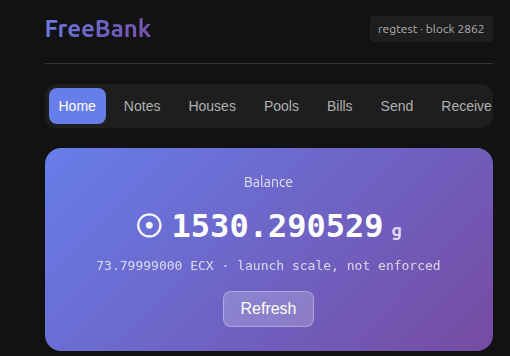

# FreeBank Wallet

Wallet for the [**FreeBank**](https://github.com/mbdrivechains/freebank) credit-creation
drivechain (BIP 300/301, slot 130).



Built with [Tauri](https://tauri.app) (Rust backend + Svelte frontend). The same web
frontend doubles as an installable **PWA**, so the wallet runs as a desktop app, a
direct-download binary, or a web page.

## Model: node-custodial, remote-controlled

FreeBank is **node-custodial** — your keys live on your `freebankd` node, not in this app.
The wallet is a thin remote control over JSON-RPC. That means you can:

- connect to the node on **this computer**, or
- reach **your own node from anywhere** over **Tailscale** (enter its `100.x.y.z` address),
  e.g. from a laptop while travelling — **your keys never leave the node**.

(A client-side-keys light wallet — "Model B" — is a later roadmap item. Tor transport is a
first-class option in the UI but not wired in this build yet.)

## Features

- Connect to a `freebankd` node via RPC (local / Tailscale / custom)
- Balance led in **grams** (☉, launch scale, presentation-only) with the **ECX**
  settlement line; transaction history
- Send and receive gECX; address generation
- **Notes** — hold / mint / send / redeem / demand, per issuing house
- **Houses** — directory, registration, reserve attestation
- **Clearing pools** — swap notes ↔ gECX, add/remove liquidity, LP positions
- **Bills of exchange** — issue / endorse / retire / claim escrow
- (Planned) bearer par-redemption flow, advisory gold oracle, "Model B" light wallet

## Quick Start

### Prerequisites

```bash
# Rust
curl --proto '=https' --tlsv1.2 -sSf https://sh.rustup.rs | sh
# Node.js 20+
curl -fsSL https://deb.nodesource.com/setup_20.x | sudo -E bash -
sudo apt install -y nodejs
# Tauri CLI + Linux webview deps
cargo install tauri-cli
sudo apt install libwebkit2gtk-4.1-dev libappindicator3-dev librsvg2-dev patchelf
```

### Development

```bash
git clone https://github.com/mbdrivechains/freebank-gui.git
cd freebank-gui
npm install
cargo tauri dev        # desktop, hot reload
# or, browser/PWA:
npm run dev            # then open http://localhost:5173
```

### Build Release

```bash
cargo tauri build      # -> src-tauri/target/release/bundle/
```

## Connect to a node

The wallet needs a running `freebankd` node with RPC enabled:

```bash
# local regtest bench (default RPC port 18457)
freebankd -regtest -daemon -rpcuser=rpcuser -rpcpassword=rpcpassword

# to reach it remotely, bind RPC to the Tailscale interface and allow the client:
#   -rpcbind=<tailscale-ip> -rpcallowip=<client-tailscale-ip-or-cidr>
```

FreeBank has two networks only — **main** (RPC 8454) and **regtest** (RPC 18457); there is
no testnet. Then enter the host/port/credentials in the connect screen.

### Browser (PWA) mode + CORS

A browser page can't send RPC directly (CORS). Either use the built-in Vite dev proxy
(`/rpc` → localhost:18457) or run the bundled CORS proxy:

```bash
python3 proxy.py --rpc-host localhost --rpc-port 18457 --rpc-user rpcuser --rpc-password rpcpassword
```

## Architecture

```
┌─────────────────────────────────────────┐
│         Svelte Frontend (+ PWA)         │
│ Connect · Notes · Houses · Pools · Bills│
└─────────────────┬───────────────────────┘
     Tauri IPC    │    or  direct fetch (PWA + CORS proxy)
┌─────────────────▼───────────────────────┐
│        Rust Backend (FreeBankClient)    │
│         JSON-RPC client (reqwest)       │
└─────────────────┬───────────────────────┘
                  │ JSON-RPC (local / Tailscale / Tor)
┌─────────────────▼───────────────────────┐
│      freebankd  (drivechain slot 130)   │
│  keys · notes · houses · pools · bills  │
└─────────────────────────────────────────┘
```

## License

MIT
